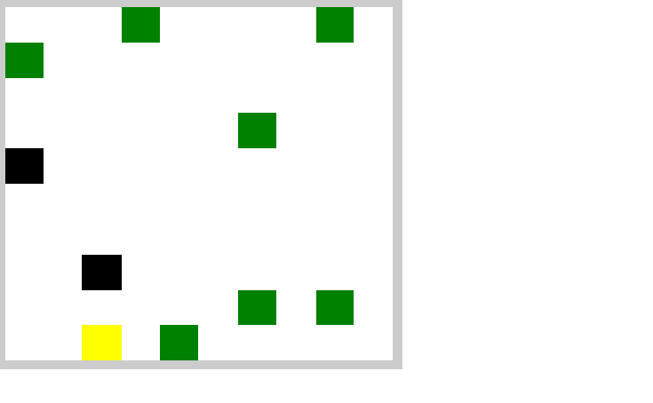

# Meu-Primeiro-Jogo-Multiplayer

&nbsp;---&nbsp;
Esse jogo é baseado no game criado por [Filipe Deschamps](https://www.youtube.com/channel/UCU5JicSrEM5A63jkJ2QvGYw)&nbsp; e você pode acessar o repositório original [clicando aqui](https://github.com/filipedeschamps/meu-primeiro-jogo-multiplayer)
&nbsp;---&nbsp;
## Características Gerais
* Multiplayer
* Linguagens/Tecnologias
  * HTML
  * CSS3
  * JavasScript
  * Express
  * Node.js
  * Socket.io
  * webpack
  * babel
* O códigio javascript é transcompilado pra versões anteriores obtendo&nbsp;
  assim uma compatibilidade com navegadores mais antigos